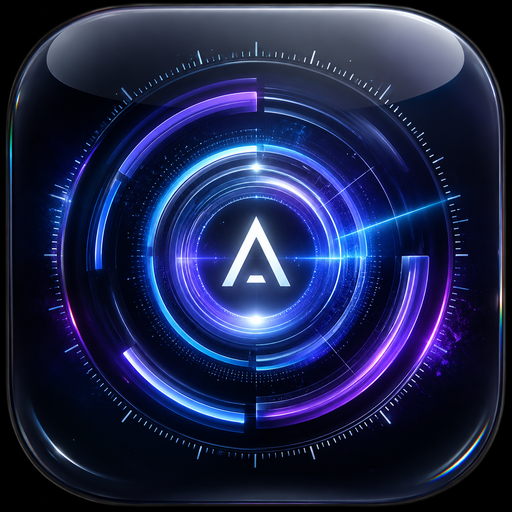

# ARIA — Spec v24 : Redesign UI complet (style dashboard)

## Vision

Interface en 3 colonnes inspirée du mockup :
- **Colonne gauche** : navigation principale (sidebar avec icônes + labels)
- **Colonne centrale** : zone principale (logo animé + chat + input)
- **Colonne droite** : widgets d'informations en temps réel (météo, mémoire, raccourcis)

Toutes les données affichées sont **réelles et vérifiées** — pas de placeholders.

---

## Layout général

```
┌─────────────┬──────────────────────────┬──────────────────┐
│  Sidebar    │    Zone principale        │  Widgets         │
│  (240px)   │    (flex: 1)             │  (280px)         │
│             │                          │                  │
│  Logo ARIA  │  [Logo animé grand]      │  Résumé du jour  │
│  ─────────  │  Bonjour, Mathis.        │  Mémoire         │
│  🏠 Accueil │  Comment puis-je aider ? │  Raccourcis      │
│  💬 Convs   │                          │                  │
│  🧠 Mémoire │  [Zone chat messages]    │                  │
│  ⚡ Routines│                          │                  │
│  📱 Agents  │  [Input zone]            │                  │
│  ⚙️ Params  │                          │                  │
└─────────────┴──────────────────────────┴──────────────────┘
```

---

## FICHIER 1 — electron/renderer/index.html (structure complète)

```html
<!DOCTYPE html>
<html lang="fr" data-theme="slate">
<head>
  <meta charset="UTF-8">
  <meta name="viewport" content="width=device-width, initial-scale=1.0">
  <meta http-equiv="Content-Security-Policy"
    content="default-src 'self'; script-src 'self' 'unsafe-inline';
             style-src 'self' 'unsafe-inline';
             img-src 'self' data: blob: http://127.0.0.1:*;
             connect-src ws://127.0.0.1:* http://127.0.0.1:*;">
  <title>ARIA</title>
  <link rel="stylesheet" href="styles.css">
</head>
<body>

<!-- Fond d'écran -->
<div id="wallpaper-layer">
  <div id="wallpaper-bg"></div>
  <div id="wallpaper-overlay"></div>
</div>

<!-- Barre de titre custom -->
<div id="title-bar">
  <div id="title-bar-drag"></div>
  <div id="window-controls">
    <button class="win-btn" onclick="ARIA.window.minimize()" title="Réduire">─</button>
    <button class="win-btn" onclick="ARIA.window.maximize()" title="Agrandir">□</button>
    <button class="win-btn close-btn" onclick="ARIA.window.close()" title="Fermer">✕</button>
  </div>
</div>

<!-- Layout principal 3 colonnes -->
<div id="app-layout">

  <!-- ═══ SIDEBAR GAUCHE ═══ -->
  <aside id="sidebar">

    <!-- Logo + nom -->
    <div id="sidebar-brand">
      <div id="sidebar-logo-wrap">
        
        <div class="sidebar-logo-ring sidebar-logo-ring-1"></div>
        <div class="sidebar-logo-ring sidebar-logo-ring-2"></div>
      </div>
      <div id="sidebar-brand-text">
        <div id="sidebar-title">ARIA</div>
        <div id="sidebar-subtitle" class="status-idle">En veille</div>
      </div>
    </div>

    <!-- Navigation -->
    <nav id="sidebar-nav">
      <button class="nav-item active" data-page="home" onclick="app.navigate('home')">
        <span class="nav-icon">🏠</span>
        <span class="nav-label">Accueil</span>
      </button>
      <button class="nav-item" data-page="conversations" onclick="app.navigate('conversations')">
        <span class="nav-icon">💬</span>
        <span class="nav-label">Conversations</span>
        <span class="nav-badge" id="conv-badge"></span>
      </button>
      <button class="nav-item" data-page="memory" onclick="app.navigate('memory')">
        <span class="nav-icon">🧠</span>
        <span class="nav-label">Mémoire</span>
      </button>
      <button class="nav-item" data-page="agents" onclick="app.navigate('agents')">
        <span class="nav-icon">🤖</span>
        <span class="nav-label">Agents</span>
      </button>
      <button class="nav-item" data-page="routines" onclick="app.navigate('routines')">
        <span class="nav-icon">⚡</span>
        <span class="nav-label">Routines</span>
      </button>
    </nav>

    <!-- Spacer -->
    <div style="flex:1"></div>

    <!-- Agent actif -->
    <div id="active-agent-chip" onclick="app.toggleAgentDropdown()">
      <span id="agent-chip-icon">🤖</span>
      <span id="agent-chip-name">ARIA</span>
      <span style="opacity:0.4;font-size:10px">▾</span>
    </div>
    <div id="agent-dropdown" class="hidden"></div>

    <!-- Paramètres -->
    <button class="nav-item" data-page="settings" onclick="app.navigate('settings')"
            style="margin-bottom:8px">
      <span class="nav-icon">⚙️</span>
      <span class="nav-label">Paramètres</span>
    </button>

  </aside>

  <!-- ═══ ZONE PRINCIPALE ═══ -->
  <main id="main-area">

    <!-- Page Accueil -->
    <div id="page-home" class="page active">
      <!-- Header -->
      <div id="home-header">
        <div id="home-greeting"></div>
        <div id="home-date"></div>
        <div id="home-mode-badge" onclick="app.toggleModeMenu()">
          <span>🔒</span>
          <span id="home-mode-label">Mode Local</span>
          <span style="opacity:0.5;font-size:10px">▾</span>
        </div>
        <div id="mode-menu" class="hidden">
          <div onclick="app.setPrivacyMode('local')">🔒 100% Local</div>
          <div onclick="app.setPrivacyMode('hybrid')">🌐 Hybride (Local + API)</div>
          <div onclick="app.setPrivacyMode('cloud')">☁️ Cloud uniquement</div>
        </div>
        <button id="mic-visual-btn" onclick="app.toggleMic()">
          <svg viewBox="0 0 24 24" width="20" height="20" fill="none">
            <rect x="9" y="2" width="6" height="13" rx="3" stroke="currentColor" stroke-width="1.5"/>
            <path d="M5 10a7 7 0 0014 0" stroke="currentColor" stroke-width="1.5" stroke-linecap="round"/>
            <line x1="12" y1="21" x2="12" y2="17" stroke="currentColor" stroke-width="1.5"/>
          </svg>
        </button>
      </div>

      <!-- Logo animé central -->
      <div id="home-logo-container">
        <div id="home-logo" class="logo-idle">
          <div class="home-logo-rings">
            <div class="h-ring h-ring-1"></div>
            <div class="h-ring h-ring-2"></div>
            <div class="h-ring h-ring-3"></div>
            <div class="h-ring h-ring-4"></div>
            <div class="h-scan-line"></div>
          </div>
          
          <div id="home-logo-particles"></div>
        </div>
        <div id="home-logo-label">
          <div id="home-hello-text">Bonjour.</div>
          <div id="home-sub-text">Comment puis-je vous aider aujourd'hui ?</div>
        </div>
      </div>

      <!-- Zone messages (visible quand conversation active) -->
      <div id="home-messages" class="hidden">
        <div id="messages"></div>
      </div>

      <!-- Zone de saisie -->
      <div id="input-area">
        <div id="input-zone">
          <label id="attach-btn" title="Joindre un fichier">
            <svg viewBox="0 0 24 24" width="18" height="18" fill="none">
              <path d="M21.44 11.05l-9.19 9.19a6 6 0 01-8.49-8.49l9.19-9.19a4 4 0 015.66 5.66l-9.2 9.19a2 2 0 01-2.83-2.83l8.49-8.48"
                stroke="currentColor" stroke-width="1.5" stroke-linecap="round"/>
            </svg>
            <input type="file" id="file-input" multiple style="display:none"
              onchange="app.handleFiles(this.files)">
          </label>

          <textarea
            id="text-input"
            placeholder="Demandez à ARIA..."
            rows="1"
            onkeydown="app.handleInputKeydown(event)"
            oninput="app.adjustTextarea(this)">
          </textarea>

          <!-- Sélecteur d'agent dans l'input -->
          <div id="input-agent-selector" onclick="app.toggleAgentDropdown()">
            <span id="input-agent-icon">🤖</span>
            <span id="input-agent-name">Assistant</span>
            <span style="opacity:0.4;font-size:9px">▾</span>
          </div>

          <!-- Bouton micro -->
          <div id="mic-btn-wrap">
            <div class="mic-ring" id="mic-ring-1"></div>
            <div class="mic-ring" id="mic-ring-2"></div>
            <button id="mic-btn" onclick="app.toggleMic()" class="mic-idle">
              <svg viewBox="0 0 24 24" width="18" height="18" fill="none">
                <rect x="9" y="2" width="6" height="13" rx="3" stroke="currentColor" stroke-width="1.5"/>
                <path d="M5 10a7 7 0 0014 0" stroke="currentColor" stroke-width="1.5" stroke-linecap="round"/>
                <line x1="12" y1="21" x2="12" y2="17" stroke="currentColor" stroke-width="1.5"/>
              </svg>
            </button>
          </div>
        </div>
      </div>
    </div>

    <!-- Page Conversations -->
    <div id="page-conversations" class="page hidden">
      <div id="conv-page-header">
        <div style="font-size:18px;font-weight:700;color:var(--text)">Conversations</div>
        <button onclick="app.newConversation()" class="page-action-btn">+ Nouvelle</button>
      </div>
      <div id="conv-list-full"></div>
    </div>

    <!-- Page Mémoire -->
    <div id="page-memory" class="page hidden">
      <div id="memory-page-header">
        <div style="font-size:18px;font-weight:700;color:var(--text)">Mémoire ARIA</div>
        <div style="font-size:12px;color:var(--text3)" id="memory-stats-label"></div>
      </div>
      <div id="memory-content"></div>
    </div>

    <!-- Page Agents -->
    <div id="page-agents" class="page hidden">
      <div style="padding:24px">
        <div style="font-size:18px;font-weight:700;color:var(--text);margin-bottom:16px">
          Agents IA
        </div>
        <div id="agents-page-list"></div>
        <button onclick="app.openAgentEditor(null)" class="page-action-btn" style="margin-top:12px">
          + Créer un agent
        </button>
      </div>
    </div>

    <!-- Page Routines -->
    <div id="page-routines" class="page hidden">
      <div style="padding:24px">
        <div style="font-size:18px;font-weight:700;color:var(--text);margin-bottom:16px">
          Routines
        </div>
        <div style="color:var(--text3);font-size:13px">Bientôt disponible</div>
      </div>
    </div>

    <!-- Page Paramètres -->
    <div id="page-settings" class="page hidden">
      <div id="settings-page-content">
        <!-- Contenu des paramètres (accordéons) -->
        <div id="settings-header-bar">
          <div style="font-size:18px;font-weight:700;color:var(--text)">Paramètres</div>
        </div>
        <div id="settings-accordions">
          <!-- Apparence -->
          <div class="settings-accordion open" id="acc-apparence">
            <div class="acc-header" onclick="app.toggleAccordion('apparence')">
              🎨 Apparence <span class="acc-chevron">▾</span>
            </div>
            <div class="acc-body">
              <div class="setting-row">
                <label>Thème</label>
                <div class="theme-pills">
                  <button onclick="app.setTheme('slate')" class="theme-pill active" data-theme="slate">Slate</button>
                  <button onclick="app.setTheme('warm')" class="theme-pill" data-theme="warm">Warm</button>
                  <button onclick="app.setTheme('forest')" class="theme-pill" data-theme="forest">Forest</button>
                  <button onclick="app.setTheme('rose')" class="theme-pill" data-theme="rose">Rose</button>
                </div>
              </div>
              <div class="setting-row">
                <label>Transparence</label>
                <input type="range" id="set-glass" min="0" max="100" value="60"
                  oninput="app.setGlassIntensity(this.value)">
              </div>
              <div class="setting-label">Fond d'écran</div>
              <div class="wallpaper-presets">
                <div class="wp-thumb wp-aurora" onclick="app.setWallpaper('aurora')"></div>
                <div class="wp-thumb wp-sunset" onclick="app.setWallpaper('sunset')"></div>
                <div class="wp-thumb wp-midnight" onclick="app.setWallpaper('midnight')"></div>
                <div class="wp-thumb wp-forest" onclick="app.setWallpaper('forest')"></div>
                <div class="wp-thumb wp-mesh" onclick="app.setWallpaper('mesh')"></div>
                <div class="wp-thumb wp-mono" onclick="app.setWallpaper('mono')"></div>
              </div>
              <div id="wallpaper-custom-grid"></div>
              <label class="settings-btn-outline">
                📷 Importer
                <input type="file" accept="image/*" style="display:none"
                  onchange="app.uploadWallpaper(this.files[0]);this.value=''">
              </label>
              <button class="settings-validate-btn" onclick="app.validateSection('apparence')">✓ Appliquer</button>
            </div>
          </div>

          <!-- Salutation personnalisable -->
          <div class="settings-accordion" id="acc-greeting">
            <div class="acc-header" onclick="app.toggleAccordion('greeting')">
              👋 Salutation <span class="acc-chevron">▸</span>
            </div>
            <div class="acc-body hidden">
              <div class="setting-row" style="flex-direction:column;align-items:flex-start;gap:6px">
                <label>Prénom affiché</label>
                <input type="text" id="set-firstname" placeholder="Mathis"
                  class="agent-input" style="width:100%"
                  onchange="app.saveSetting('user_firstname', this.value)">
              </div>
              <div class="setting-row" style="flex-direction:column;align-items:flex-start;gap:6px">
                <label>Texte de bienvenue</label>
                <input type="text" id="set-hello-text" placeholder="Bonjour."
                  class="agent-input" style="width:100%"
                  onchange="app.saveSetting('hello_text', this.value)">
              </div>
              <div class="setting-row" style="flex-direction:column;align-items:flex-start;gap:6px">
                <label>Sous-texte</label>
                <input type="text" id="set-sub-text"
                  placeholder="Comment puis-je vous aider aujourd'hui ?"
                  class="agent-input" style="width:100%"
                  onchange="app.saveSetting('sub_text', this.value)">
              </div>
              <button class="settings-validate-btn" onclick="app.applyGreeting()">✓ Appliquer</button>
            </div>
          </div>

          <!-- Voix, Modèles, Micro, Agents, Clés API, Système — mêmes accordéons qu'avant -->
          <div class="settings-accordion" id="acc-voix">
            <div class="acc-header" onclick="app.toggleAccordion('voix')">🎙️ Voix <span class="acc-chevron">▸</span></div>
            <div class="acc-body hidden">
              <div class="setting-row">
                <label>TTS activé</label>
                <input type="checkbox" id="set-tts" onchange="app.saveSetting('tts_enabled', this.checked)">
              </div>
              <div class="setting-row">
                <label>Vitesse</label>
                <input type="range" id="set-tts-rate" min="-50" max="50" value="0"
                  oninput="app.saveSetting('tts_rate', parseInt(this.value))">
              </div>
              <button class="settings-validate-btn" onclick="app.validateSection('voix')">✓ Appliquer</button>
            </div>
          </div>

          <div class="settings-accordion" id="acc-modeles">
            <div class="acc-header" onclick="app.toggleAccordion('modeles')">🤖 Modèles IA <span class="acc-chevron">▸</span></div>
            <div class="acc-body hidden">
              <div id="model-settings"><div class="loading-text">Cliquer pour charger...</div></div>
              <button class="settings-btn-outline" onclick="app.loadModelSettings()" style="margin-top:8px">🔄 Rafraîchir</button>
            </div>
          </div>

          <div class="settings-accordion" id="acc-apikeys">
            <div class="acc-header" onclick="app.toggleAccordion('apikeys')">🔑 Clés API <span class="acc-chevron">▸</span></div>
            <div class="acc-body hidden">
              <div style="font-size:11px;color:var(--text3);margin-bottom:10px;line-height:1.5">
                Connecte des IAs externes en complément des modèles locaux.
              </div>
              <div id="api-keys-list"></div>
            </div>
          </div>

          <div class="settings-accordion" id="acc-micro">
            <div class="acc-header" onclick="app.toggleAccordion('micro')">🎤 Micro <span class="acc-chevron">▸</span></div>
            <div class="acc-body hidden">
              <div class="setting-row">
                <label>Device index</label>
                <input type="number" id="set-device-index" placeholder="auto"
                  class="agent-input" style="width:70px"
                  onchange="app.saveSetting('stt.device_index', parseInt(this.value) || null)">
              </div>
              <div class="setting-row">
                <label>Modèle Whisper</label>
                <select id="set-whisper-model" class="agent-select"
                  onchange="app.saveSetting('stt.model', this.value)">
                  <option value="tiny">Tiny</option>
                  <option value="base">Base</option>
                  <option value="small" selected>Small ★</option>
                  <option value="medium">Medium</option>
                </select>
              </div>
              <button class="settings-validate-btn" onclick="app.validateSection('micro')">✓ Appliquer</button>
            </div>
          </div>

          <div class="settings-accordion" id="acc-systeme">
            <div class="acc-header" onclick="app.toggleAccordion('systeme')">⚙️ Système <span class="acc-chevron">▸</span></div>
            <div class="acc-body hidden">
              <div class="setting-row">
                <label>Tuer Ollama à la fermeture</label>
                <input type="checkbox" id="set-kill-ollama" checked
                  onchange="app.saveSetting('kill_ollama_on_exit', this.checked)">
              </div>
            </div>
          </div>

        </div>
      </div>
    </div>

  </main>

  <!-- ═══ WIDGETS DROITE ═══ -->
  <aside id="widgets-panel">

    <!-- Widget Résumé du jour -->
    <div class="widget" id="widget-summary">
      <div class="widget-header">
        <span class="widget-title">Résumé du jour</span>
        <button class="widget-collapse" onclick="app.toggleWidget('summary')">∧</button>
      </div>
      <div class="widget-body" id="widget-summary-body">
        <div class="widget-row" id="wrow-tasks">
          <span class="widget-icon">✅</span>
          <span class="widget-label" id="wlabel-tasks">Chargement...</span>
          <span class="widget-value" id="wval-tasks"></span>
        </div>
        <div class="widget-row" id="wrow-meteo">
          <span class="widget-icon" id="wicon-meteo">🌡️</span>
          <span class="widget-label">Météo</span>
          <span class="widget-value" id="wval-meteo">...</span>
        </div>
        <div class="widget-row" id="wrow-battery">
          <span class="widget-icon">🔋</span>
          <span class="widget-label">Batterie</span>
          <span class="widget-value" id="wval-battery">...</span>
        </div>
        <div class="widget-row" id="wrow-time">
          <span class="widget-icon">🕐</span>
          <span class="widget-label">Heure</span>
          <span class="widget-value" id="wval-time">...</span>
        </div>
      </div>
    </div>

    <!-- Widget Mémoire ARIA -->
    <div class="widget" id="widget-memory">
      <div class="widget-header">
        <span class="widget-title">Mémoire</span>
        <button class="widget-collapse" onclick="app.toggleWidget('memory')">∧</button>
      </div>
      <div class="widget-body" id="widget-memory-body">
        <div id="memory-donut-container">
          <canvas id="memory-donut" width="100" height="100"></canvas>
          <div id="memory-donut-label">
            <div id="memory-pct">...</div>
            <div style="font-size:9px;color:var(--text3)">Utilisée</div>
          </div>
        </div>
        <div id="memory-details">
          <div class="mem-row">
            <span>Conversations</span>
            <span id="mem-convs">...</span>
          </div>
          <div class="mem-row">
            <span>Messages</span>
            <span id="mem-msgs">...</span>
          </div>
          <div class="mem-row">
            <span>Sessions</span>
            <span id="mem-sessions">...</span>
          </div>
        </div>
        <button class="widget-action-btn" onclick="app.navigate('memory')">
          Explorer la mémoire
        </button>
      </div>
    </div>

    <!-- Widget Raccourcis -->
    <div class="widget" id="widget-shortcuts">
      <div class="widget-header">
        <span class="widget-title">Raccourcis</span>
        <button class="widget-collapse" onclick="app.toggleWidget('shortcuts')">∧</button>
      </div>
      <div class="widget-body" id="widget-shortcuts-body">
        <div id="shortcuts-grid">
          <!-- Générés dynamiquement depuis les presets -->
        </div>
      </div>
    </div>

  </aside>

</div>

<!-- Modals -->
<div id="mode-select-overlay" class="hidden">
  <div id="mode-select-card">
    <div id="msc-logo">
      
    </div>
    <div id="msc-title">Comment veux-tu échanger ?</div>
    <div id="msc-buttons">
      <button onclick="app.selectConversationMode('ecrit')">
        <span>💬</span><span>Écrit</span>
      </button>
      <button onclick="app.selectConversationMode('vocal')">
        <span>🎙️</span><span>Vocal</span>
      </button>
    </div>
  </div>
</div>

<!-- Agent editor modal -->
<div id="agent-editor-modal" class="modal-overlay hidden">
  <!-- ... contenu inchangé de la spec v23 ... -->
</div>

<!-- Toast container -->
<div id="toast-container"></div>

<script src="app.js"></script>
</body>
</html>
```

---

## FICHIER 2 — Widgets : données réelles (app.js additions)

```javascript
// ── Widgets temps réel ────────────────────────────────────────────────────────

async function initWidgets() {
  updateClock();
  setInterval(updateClock, 1000);

  await loadWeatherWidget();
  setInterval(loadWeatherWidget, 5 * 60 * 1000); // toutes les 5min

  await loadMemoryWidget();
  setInterval(loadMemoryWidget, 30 * 1000); // toutes les 30s

  loadShortcutsWidget();
}

// ── Horloge ───────────────────────────────────────────────────────────────────

function updateClock() {
  const now = new Date();
  const timeEl = document.getElementById('wval-time');
  const greetingEl = document.getElementById('home-greeting');
  const dateEl = document.getElementById('home-date');

  if (timeEl) {
    timeEl.textContent = now.toLocaleTimeString('fr-FR', {
      hour: '2-digit', minute: '2-digit'
    });
  }

  if (greetingEl) {
    const h = now.getHours();
    const firstname = state.settings?.user_firstname || 'Mathis';
    let salut = h < 12 ? 'Bonjour' : h < 18 ? 'Bon après-midi' : 'Bonsoir';
    greetingEl.textContent = `${salut}, ${firstname}.`;
  }

  if (dateEl) {
    dateEl.textContent = now.toLocaleDateString('fr-FR', {
      weekday: 'long', day: 'numeric', month: 'long'
    });
  }

  // Mettre à jour le texte de bienvenue
  const helloEl = document.getElementById('home-hello-text');
  const subEl = document.getElementById('home-sub-text');
  if (helloEl) {
    const h = now.getHours();
    const firstname = state.settings?.user_firstname || 'Mathis';
    helloEl.textContent = state.settings?.hello_text ||
      (h < 12 ? `Bonjour, ${firstname}.` : h < 18 ? `Bon après-midi, ${firstname}.` : `Bonsoir, ${firstname}.`);
  }
  if (subEl) {
    subEl.textContent = state.settings?.sub_text || 'Comment puis-je vous aider aujourd\'hui ?';
  }
}

// ── Météo (vraie donnée depuis le backend) ────────────────────────────────────

async function loadWeatherWidget() {
  try {
    const raw = await window.ARIA.call('get_weather_widget');
    const data = JSON.parse(raw || '{}');

    const valEl = document.getElementById('wval-meteo');
    const iconEl = document.getElementById('wicon-meteo');

    if (data.error || !data.temp) {
      if (valEl) valEl.textContent = 'N/A';
      return;
    }

    // Icône selon la description
    const weatherIcons = {
      'ensoleillé': '☀️', 'clair': '☀️', 'nuageux': '☁️',
      'couvert': '☁️', 'pluie': '🌧️', 'brouillard': '🌫️',
      'neige': '❄️', 'orage': '⛈️',
    };
    const desc = (data.description || '').toLowerCase();
    const icon = Object.entries(weatherIcons).find(([k]) => desc.includes(k))?.[1] || '🌡️';

    if (iconEl) iconEl.textContent = icon;
    if (valEl) valEl.textContent = `${Math.round(data.temp)}° ${data.city || ''}`;

  } catch(e) {
    const el = document.getElementById('wval-meteo');
    if (el) el.textContent = 'N/A';
  }
}

// ── Mémoire ARIA (vraie donnée) ────────────────────────────────────────────────

async function loadMemoryWidget() {
  try {
    const raw = await window.ARIA.call('get_memory_stats');
    const data = JSON.parse(raw || '{}');

    document.getElementById('mem-convs').textContent = data.conversations || '0';
    document.getElementById('mem-msgs').textContent = data.messages || '0';
    document.getElementById('mem-sessions').textContent = data.sessions || '0';

    // Donut chart
    const pct = Math.min(100, Math.round((data.messages || 0) / 5));  // 500 msgs = 100%
    document.getElementById('memory-pct').textContent = pct + '%';
    drawMemoryDonut(pct);

    // Label stats
    const statsEl = document.getElementById('memory-stats-label');
    if (statsEl) {
      statsEl.textContent = `${data.conversations} conversations · ${data.messages} messages`;
    }

  } catch(e) {}
}

function drawMemoryDonut(pct) {
  const canvas = document.getElementById('memory-donut');
  if (!canvas) return;
  const ctx = canvas.getContext('2d');
  const cx = 50, cy = 50, r = 38, lw = 8;

  ctx.clearRect(0, 0, 100, 100);

  // Fond
  ctx.beginPath();
  ctx.arc(cx, cy, r, 0, Math.PI * 2);
  ctx.strokeStyle = 'rgba(255,255,255,0.08)';
  ctx.lineWidth = lw;
  ctx.stroke();

  // Arc rempli
  const angle = (pct / 100) * Math.PI * 2 - Math.PI / 2;
  const grad = ctx.createLinearGradient(0, 0, 100, 100);
  grad.addColorStop(0, '#6C8EFF');
  grad.addColorStop(1, '#A78BFA');
  ctx.beginPath();
  ctx.arc(cx, cy, r, -Math.PI / 2, angle);
  ctx.strokeStyle = grad;
  ctx.lineWidth = lw;
  ctx.lineCap = 'round';
  ctx.stroke();
}

// ── Raccourcis (depuis les presets) ───────────────────────────────────────────

async function loadShortcutsWidget() {
  try {
    const raw = await window.ARIA.call('get_presets');
    const presets = JSON.parse(raw || '[]');
    const grid = document.getElementById('shortcuts-grid');
    if (!grid) return;

    // Raccourcis fixes + presets
    const fixed = [
      { icon: '✉️', label: 'Rédiger un email', action: 'rédige un email', color: '#6C8EFF' },
      { icon: '🎯', label: 'Démarrer focus', action: 'active le mode focus', color: '#A78BFA' },
      { icon: '📊', label: 'Analyse système', action: 'analyse le système', color: '#4ADE80' },
    ];

    const presetShortcuts = presets.slice(0, 2).map(p => ({
      icon: p.icon || '⚡',
      label: `Mode ${p.name}`,
      action: `active le mode ${p.name}`,
      color: '#F59E0B',
    }));

    const all = [...fixed, ...presetShortcuts].slice(0, 6);

    grid.innerHTML = all.map(s => `
      <button class="shortcut-btn" onclick="app.quickAction('${s.action}')"
              style="--shortcut-color: ${s.color}">
        <span class="shortcut-icon">${s.icon}</span>
        <span class="shortcut-label">${s.label}</span>
      </button>
    `).join('');
  } catch(e) {}
}

// Action rapide depuis un raccourci
async function quickAction(text) {
  app.navigate('home');
  document.getElementById('home-messages')?.classList.remove('hidden');
  document.getElementById('home-logo-container')?.classList.add('shrunk');
  await window.ARIA.call('ask', text, state.conversationMode);
}

// ── Navigation entre pages ────────────────────────────────────────────────────

function navigate(page) {
  // Masquer toutes les pages
  document.querySelectorAll('.page').forEach(p => p.classList.add('hidden'));
  document.querySelectorAll('.nav-item').forEach(n => n.classList.remove('active'));

  // Afficher la page cible
  const pageEl = document.getElementById(`page-${page}`);
  if (pageEl) pageEl.classList.remove('hidden');

  // Activer le bouton nav
  const navBtn = document.querySelector(`[data-page="${page}"]`);
  if (navBtn) navBtn.classList.add('active');

  state.currentPage = page;

  // Charger le contenu selon la page
  if (page === 'conversations') loadFullConversationList();
  if (page === 'agents') loadAgentsPage();
  if (page === 'memory') loadMemoryPage();
  if (page === 'settings') {
    loadModelSettings();
    loadApiKeys();
    applySettingsForm();
  }
}

// ── Salutation personnalisable ─────────────────────────────────────────────────

function applyGreeting() {
  updateClock();
  showStyledSettingToast('✓ Salutation mise à jour', '#4ADE80');
}

function applySettingsForm() {
  const s = state.settings;
  if (s.user_firstname) {
    const el = document.getElementById('set-firstname');
    if (el) el.value = s.user_firstname;
  }
  if (s.hello_text) {
    const el = document.getElementById('set-hello-text');
    if (el) el.value = s.hello_text;
  }
  if (s.sub_text) {
    const el = document.getElementById('set-sub-text');
    if (el) el.value = s.sub_text;
  }
}

// ── Logo home : se réduit quand une conversation est active ───────────────────

function showHomeConversation() {
  document.getElementById('home-logo-container')?.classList.add('shrunk');
  document.getElementById('home-messages')?.classList.remove('hidden');
}

function showHomeIdle() {
  document.getElementById('home-logo-container')?.classList.remove('shrunk');
  document.getElementById('home-messages')?.classList.add('hidden');
  document.getElementById('messages').innerHTML = '';
}

// Appeler initWidgets() dans init() :
// async function init() {
//   await waitForBackend();
//   await loadSettings();
//   ...
//   await initWidgets();   // ← ajouter ici
//   ...
// }
```

---

## FICHIER 3 — ui_bridge.py : nouvelles fonctions exposées

```python
@expose
def get_weather_widget() -> dict:
    """Météo pour le widget — utilise OpenWeatherMap si clé dispo, sinon wttr.in."""
    import requests, yaml
    import app_paths

    try:
        with app_paths.config_path().open('r', encoding='utf-8') as f:
            cfg = yaml.safe_load(f) or {}

        city = cfg.get('weather', {}).get('city', 'Couëron')
        api_key = cfg.get('weather', {}).get('api_key', '')

        if api_key:
            r = requests.get(
                'https://api.openweathermap.org/data/2.5/weather',
                params={'q': city, 'appid': api_key, 'units': 'metric', 'lang': 'fr'},
                timeout=5
            )
            if r.status_code == 200:
                d = r.json()
                return {
                    'temp': d['main']['temp'],
                    'description': d['weather'][0]['description'],
                    'city': d['name'],
                    'humidity': d['main']['humidity'],
                    'wind': d['wind']['speed'],
                }

        # Fallback wttr.in (gratuit, sans clé)
        r = requests.get(
            f'https://wttr.in/{requests.utils.quote(city)}?format=j1',
            timeout=5
        )
        if r.status_code == 200:
            d = r.json()
            current = d['current_condition'][0]
            return {
                'temp': float(current['temp_C']),
                'description': current['weatherDesc'][0]['value'],
                'city': city,
                'humidity': int(current['humidity']),
                'wind': float(current['windspeedKmph']),
            }
    except Exception as e:
        logger.debug("Weather widget error: %s", e)

    return {'error': 'unavailable'}


@expose
def get_memory_stats() -> dict:
    """Statistiques de la mémoire ARIA."""
    import memory_engine as _me
    try:
        all_convs = _me.get_all_conversations()
        total_msgs = sum(
            len(_me.get_conversation_messages(c['id']))
            for c in all_convs
        )
        return {
            'conversations': len(all_convs),
            'messages': total_msgs,
            'sessions': _me._memory.get('session_count', 0),
        }
    except Exception as e:
        logger.error("get_memory_stats: %s", e)
        return {'conversations': 0, 'messages': 0, 'sessions': 0}


@expose
def get_presets() -> list:
    """Retourne les presets configurés."""
    import yaml, app_paths
    try:
        with app_paths.config_path().open('r', encoding='utf-8') as f:
            cfg = yaml.safe_load(f) or {}
        presets = cfg.get('presets', {})
        return [
            {'id': k, 'name': v.get('name', k), 'icon': v.get('icon', '⚙️')}
            for k, v in presets.items()
        ]
    except:
        return []
```

---

## FICHIER 4 — styles.css : nouveau layout 3 colonnes

```css
/* ── Layout 3 colonnes ────────────────────────────────────────────── */
#app-layout {
  display: grid;
  grid-template-columns: 240px 1fr 280px;
  height: 100vh;
  padding-top: 32px;
  overflow: hidden;
}

/* ── Sidebar ──────────────────────────────────────────────────────── */
#sidebar {
  display: flex;
  flex-direction: column;
  background: rgba(12,12,20,calc(var(--glass-alpha) + 0.05));
  backdrop-filter: blur(var(--glass-blur)) saturate(180%);
  border-right: 1px solid rgba(255,255,255,0.05);
  padding: 12px 10px;
  overflow: hidden;
}

#sidebar-brand {
  display: flex;
  align-items: center;
  gap: 10px;
  padding: 8px 8px 16px;
}

#sidebar-logo-wrap {
  position: relative;
  width: 40px; height: 40px;
  flex-shrink: 0;
}

#sidebar-logo-img {
  width: 40px; height: 40px;
  border-radius: 10px;
  object-fit: cover;
  position: relative; z-index: 2;
  filter: drop-shadow(0 0 6px rgba(108,142,255,0.4));
}

.sidebar-logo-ring {
  position: absolute;
  border-radius: 50%;
  border: 1px solid rgba(108,142,255,0.3);
  pointer-events: none;
  opacity: 0;
  transition: opacity 0.4s;
}

.sidebar-logo-ring-1 { inset: -5px; }
.sidebar-logo-ring-2 { inset: -10px; }

#sidebar-title {
  font-size: 18px;
  font-weight: 800;
  color: var(--text);
  letter-spacing: 2px;
}

#sidebar-subtitle {
  font-size: 11px;
  color: var(--text3);
  margin-top: 1px;
  transition: color 0.3s;
}

#sidebar-subtitle.status-listening { color: #4ADE80; }
#sidebar-subtitle.status-thinking { color: #A78BFA; }
#sidebar-subtitle.status-speaking { color: #4ADE80; }

/* Navigation */
#sidebar-nav {
  display: flex;
  flex-direction: column;
  gap: 2px;
}

.nav-item {
  display: flex;
  align-items: center;
  gap: 10px;
  padding: 10px 12px;
  border-radius: 12px;
  background: transparent;
  border: none;
  color: var(--text3);
  font-family: inherit;
  font-size: 13px;
  font-weight: 500;
  cursor: pointer;
  text-align: left;
  transition: background 0.15s, color 0.15s;
  position: relative;
  width: 100%;
}

.nav-item:hover {
  background: rgba(255,255,255,0.06);
  color: var(--text);
}

.nav-item.active {
  background: rgba(108,142,255,0.12);
  color: var(--accent);
}

.nav-icon { font-size: 18px; flex-shrink: 0; width: 24px; text-align: center; }
.nav-label { flex: 1; }

.nav-badge {
  background: var(--accent);
  color: white;
  font-size: 9px;
  padding: 1px 5px;
  border-radius: 8px;
  font-weight: 600;
}

/* Agent chip en bas de sidebar */
#active-agent-chip {
  display: flex;
  align-items: center;
  gap: 6px;
  padding: 8px 12px;
  background: rgba(255,255,255,0.04);
  border: 1px solid rgba(255,255,255,0.07);
  border-radius: 10px;
  cursor: pointer;
  font-size: 12px;
  color: var(--text2);
  margin: 4px 0;
  transition: background 0.15s;
}

#active-agent-chip:hover { background: rgba(255,255,255,0.08); }

/* ── Zone principale ──────────────────────────────────────────────── */
#main-area {
  display: flex;
  flex-direction: column;
  overflow: hidden;
  position: relative;
}

.page {
  flex: 1;
  display: flex;
  flex-direction: column;
  overflow: hidden;
}

.page.hidden { display: none; }

/* Page home */
#page-home {
  align-items: stretch;
}

/* Header home */
#home-header {
  display: flex;
  align-items: center;
  gap: 10px;
  padding: 14px 24px;
  flex-shrink: 0;
}

#home-greeting {
  font-size: 13px;
  color: var(--text2);
  font-weight: 500;
}

#home-date {
  font-size: 11px;
  color: var(--text3);
  margin-left: 4px;
}

#home-mode-badge {
  margin-left: auto;
  display: flex;
  align-items: center;
  gap: 6px;
  padding: 5px 12px;
  background: rgba(255,255,255,0.05);
  border: 1px solid rgba(255,255,255,0.08);
  border-radius: 20px;
  font-size: 12px;
  color: var(--text2);
  cursor: pointer;
  position: relative;
  transition: background 0.15s;
}

#home-mode-badge:hover { background: rgba(255,255,255,0.09); }

#mode-menu {
  position: absolute;
  top: calc(100% + 6px);
  right: 0;
  background: rgba(16,16,28,0.9);
  backdrop-filter: blur(30px);
  border: 1px solid var(--border);
  border-radius: 12px;
  padding: 6px;
  min-width: 200px;
  z-index: 500;
  box-shadow: 0 12px 40px rgba(0,0,0,0.35);
}

#mode-menu div {
  padding: 8px 12px;
  border-radius: 8px;
  font-size: 12px;
  color: var(--text2);
  cursor: pointer;
  transition: background 0.1s;
}

#mode-menu div:hover { background: rgba(255,255,255,0.07); }

#mic-visual-btn {
  width: 36px; height: 36px;
  border-radius: 10px;
  background: rgba(255,255,255,0.06);
  border: 1px solid var(--border);
  color: var(--text2);
  cursor: pointer;
  display: flex; align-items: center; justify-content: center;
  transition: background 0.15s, color 0.15s;
}

#mic-visual-btn:hover { background: rgba(108,142,255,0.15); color: var(--accent); }

/* Logo home central */
#home-logo-container {
  flex: 1;
  display: flex;
  flex-direction: column;
  align-items: center;
  justify-content: center;
  gap: 24px;
  transition: all 0.5s cubic-bezier(0.34,1.2,0.64,1);
  padding: 20px;
}

#home-logo-container.shrunk {
  flex: 0;
  flex-basis: 120px;
  gap: 10px;
}

#home-logo {
  position: relative;
  width: 180px; height: 180px;
  display: flex;
  align-items: center;
  justify-content: center;
  transition: all 0.5s cubic-bezier(0.34,1.2,0.64,1);
}

#home-logo-container.shrunk #home-logo {
  width: 80px; height: 80px;
}

#home-logo-img {
  width: 120px; height: 120px;
  border-radius: 30px;
  object-fit: cover;
  position: relative; z-index: 2;
  filter: drop-shadow(0 0 24px rgba(108,142,255,0.5));
  transition: all 0.5s;
}

#home-logo-container.shrunk #home-logo-img {
  width: 60px; height: 60px;
  border-radius: 14px;
}

/* Anneaux du logo home */
.home-logo-rings {
  position: absolute; inset: -20px;
  pointer-events: none;
}

.h-ring {
  position: absolute;
  border-radius: 50%;
  border: 1.5px solid transparent;
  opacity: 0;
  transition: opacity 0.4s;
}

.h-ring-1 { inset: 10px; border-color: rgba(108,142,255,0.5); animation: hRing1 8s linear infinite; }
.h-ring-2 { inset: 0; border-color: rgba(167,139,250,0.35); animation: hRing2 12s linear infinite reverse; }
.h-ring-3 { inset: -10px; border-color: rgba(108,142,255,0.2); animation: hRing3 6s linear infinite; border-style: dashed; }
.h-ring-4 { inset: -20px; border-color: rgba(167,139,250,0.1); animation: hRing2 16s linear infinite; }

@keyframes hRing1 { from { transform: rotate(0deg); } to { transform: rotate(360deg); } }
@keyframes hRing2 { from { transform: rotate(0deg); } to { transform: rotate(360deg); } }
@keyframes hRing3 { from { transform: rotate(0deg); } to { transform: rotate(360deg); } }

.h-scan-line {
  position: absolute; inset: 0;
  border-radius: 50%;
  background: conic-gradient(from 0deg, transparent 0deg, rgba(108,142,255,0.6) 20deg, transparent 40deg);
  animation: hScan 2s linear infinite;
  opacity: 0;
  transition: opacity 0.4s;
  mix-blend-mode: screen;
}

@keyframes hScan { from { transform: rotate(0deg); } to { transform: rotate(360deg); } }

/* États logo home */
.logo-idle .h-ring-1 { opacity: 0.4; }
.logo-idle #home-logo-img { animation: homeLogoBreath 4s ease-in-out infinite; }

@keyframes homeLogoBreath {
  0%,100% { filter: drop-shadow(0 0 20px rgba(108,142,255,0.4)); }
  50%     { filter: drop-shadow(0 0 35px rgba(108,142,255,0.7)); }
}

.logo-listening .h-ring-1, .logo-listening .h-ring-2 { opacity: 1; }
.logo-listening #home-logo-img { filter: drop-shadow(0 0 30px rgba(74,222,128,0.7)); animation: homeListenPulse 1.5s ease-in-out infinite; }
@keyframes homeListenPulse { 0%,100% { transform: scale(1); } 50% { transform: scale(1.04); } }

.logo-thinking .h-ring-1, .logo-thinking .h-ring-2,
.logo-thinking .h-ring-3, .logo-thinking .h-ring-4 { opacity: 1; }
.logo-thinking .h-scan-line { opacity: 1; }
.logo-thinking .h-ring-1 { animation-duration: 2s; }
.logo-thinking .h-ring-2 { animation-duration: 3s; }
.logo-thinking .h-ring-3 { animation-duration: 1.5s; }
.logo-thinking .h-scan-line { animation-duration: 0.8s; }
.logo-thinking #home-logo-img {
  filter: drop-shadow(0 0 40px rgba(167,139,250,0.9)) brightness(1.2);
  animation: homeThinkPulse 0.7s ease-in-out infinite;
}
@keyframes homeThinkPulse {
  0%,100% { transform: scale(1); }
  50%     { transform: scale(1.06); }
}

/* Labels sous le logo */
#home-logo-label { text-align: center; transition: all 0.4s; }

#home-hello-text {
  font-size: 36px;
  font-weight: 800;
  background: linear-gradient(135deg, #6C8EFF, #A78BFA, #60A5FA);
  -webkit-background-clip: text;
  -webkit-text-fill-color: transparent;
  background-clip: text;
  letter-spacing: -0.5px;
  line-height: 1.1;
  transition: font-size 0.4s;
}

#home-logo-container.shrunk #home-hello-text { font-size: 18px; }

#home-sub-text {
  font-size: 15px;
  color: var(--text3);
  margin-top: 8px;
  transition: font-size 0.4s;
}

#home-logo-container.shrunk #home-sub-text { display: none; }

/* Zone messages */
#home-messages {
  flex: 1;
  overflow-y: auto;
  padding: 16px 24px;
}

/* ── Zone de saisie ────────────────────────────────────────────────── */
#input-area {
  padding: 12px 20px 20px;
  flex-shrink: 0;
}

#input-zone {
  display: flex;
  align-items: flex-end;
  gap: 8px;
  background: rgba(255,255,255,0.06);
  backdrop-filter: blur(20px) saturate(180%);
  border: 1px solid rgba(255,255,255,0.09);
  border-radius: 20px;
  padding: 8px 8px 8px 14px;
  transition: border-color 0.2s, box-shadow 0.2s;
}

#input-zone:focus-within {
  border-color: rgba(108,142,255,0.35);
  box-shadow: 0 0 0 3px rgba(108,142,255,0.08);
}

#attach-btn {
  width: 34px; height: 34px;
  display: flex; align-items: center; justify-content: center;
  background: rgba(255,255,255,0.06);
  border: 1px solid var(--border);
  border-radius: 8px;
  color: var(--text3);
  cursor: pointer;
  flex-shrink: 0;
  transition: background 0.15s;
}

#attach-btn:hover { background: rgba(255,255,255,0.1); color: var(--text); }

#text-input {
  flex: 1;
  background: transparent;
  border: none; outline: none;
  color: var(--text);
  font-family: inherit;
  font-size: 14px;
  line-height: 1.5;
  resize: none;
  max-height: 120px;
  overflow-y: auto;
  padding: 4px 0;
}

#text-input::placeholder { color: var(--text3); }

/* Sélecteur d'agent dans l'input */
#input-agent-selector {
  display: flex;
  align-items: center;
  gap: 5px;
  padding: 5px 10px;
  background: rgba(255,255,255,0.05);
  border: 1px solid rgba(255,255,255,0.08);
  border-radius: 14px;
  font-size: 11px;
  color: var(--text2);
  cursor: pointer;
  flex-shrink: 0;
  white-space: nowrap;
  transition: background 0.15s;
}

#input-agent-selector:hover { background: rgba(255,255,255,0.09); }

/* Bouton micro dans l'input */
#mic-btn-wrap {
  position: relative;
  width: 40px; height: 40px;
  flex-shrink: 0;
}

.mic-ring {
  position: absolute; inset: 0;
  border-radius: 50%;
  border: 1.5px solid rgba(108,142,255,0.4);
  opacity: 0; pointer-events: none;
}

#mic-btn {
  position: absolute; inset: 0;
  border-radius: 50%;
  background: var(--accent);
  border: none;
  color: white;
  cursor: pointer;
  display: flex; align-items: center; justify-content: center;
  transition: all 0.2s;
  z-index: 2;
}

#mic-btn:hover { transform: scale(1.08); }
#mic-btn.mic-listening { background: #4ADE80; }
#mic-btn.mic-speaking-detected { background: #34D399; }

/* ── Widgets droite ────────────────────────────────────────────────── */
#widgets-panel {
  display: flex;
  flex-direction: column;
  gap: 10px;
  padding: 14px 12px;
  background: rgba(12,12,20,calc(var(--glass-alpha) + 0.03));
  backdrop-filter: blur(var(--glass-blur)) saturate(180%);
  border-left: 1px solid rgba(255,255,255,0.05);
  overflow-y: auto;
}

#widgets-panel::-webkit-scrollbar { width: 3px; }
#widgets-panel::-webkit-scrollbar-thumb { background: rgba(255,255,255,0.08); }

.widget {
  background: rgba(255,255,255,0.04);
  border: 1px solid rgba(255,255,255,0.07);
  border-radius: 16px;
  overflow: hidden;
  transition: border-color 0.2s;
}

.widget:hover { border-color: rgba(255,255,255,0.1); }

.widget-header {
  display: flex;
  align-items: center;
  justify-content: space-between;
  padding: 12px 14px;
  border-bottom: 1px solid rgba(255,255,255,0.05);
}

.widget-title {
  font-size: 12px;
  font-weight: 600;
  color: var(--text2);
  letter-spacing: 0.3px;
}

.widget-collapse {
  background: none; border: none;
  color: var(--text3); cursor: pointer;
  font-size: 12px; padding: 2px 4px;
  border-radius: 4px;
  transition: background 0.1s;
}

.widget-collapse:hover { background: rgba(255,255,255,0.08); }

.widget-body { padding: 12px 14px; }

/* Rows du widget résumé */
.widget-row {
  display: flex;
  align-items: center;
  gap: 8px;
  padding: 7px 0;
  border-bottom: 1px solid rgba(255,255,255,0.04);
  font-size: 12px;
}

.widget-row:last-child { border-bottom: none; }
.widget-icon { font-size: 14px; flex-shrink: 0; width: 20px; text-align: center; }
.widget-label { flex: 1; color: var(--text2); }
.widget-value { color: var(--text); font-weight: 500; }

/* Donut mémoire */
#memory-donut-container {
  position: relative;
  display: flex;
  justify-content: center;
  margin-bottom: 12px;
}

#memory-donut-label {
  position: absolute;
  top: 50%; left: 50%;
  transform: translate(-50%, -50%);
  text-align: center;
}

#memory-pct {
  font-size: 18px;
  font-weight: 700;
  color: var(--text);
}

.mem-row {
  display: flex;
  justify-content: space-between;
  font-size: 11px;
  padding: 4px 0;
  color: var(--text3);
}

.mem-row span:last-child { color: var(--text); font-weight: 500; }

.widget-action-btn {
  width: 100%;
  margin-top: 10px;
  padding: 8px;
  background: rgba(108,142,255,0.1);
  border: 1px solid rgba(108,142,255,0.2);
  border-radius: 8px;
  color: var(--accent);
  font-family: inherit;
  font-size: 11px;
  cursor: pointer;
  transition: background 0.15s;
}

.widget-action-btn:hover { background: rgba(108,142,255,0.18); }

/* Grille raccourcis */
#shortcuts-grid {
  display: grid;
  grid-template-columns: 1fr 1fr;
  gap: 6px;
}

.shortcut-btn {
  display: flex;
  flex-direction: column;
  align-items: flex-start;
  gap: 5px;
  padding: 10px 10px;
  background: rgba(255,255,255,0.04);
  border: 1px solid rgba(255,255,255,0.07);
  border-radius: 10px;
  cursor: pointer;
  font-family: inherit;
  text-align: left;
  transition: background 0.15s, border-color 0.15s, transform 0.1s;
}

.shortcut-btn:hover {
  background: rgba(var(--shortcut-color), 0.1);
  border-color: rgba(255,255,255,0.12);
  transform: translateY(-1px);
}

.shortcut-icon { font-size: 18px; }

.shortcut-label {
  font-size: 10px;
  color: var(--text2);
  line-height: 1.3;
  font-weight: 500;
}

/* ── Pages secondaires ─────────────────────────────────────────────── */
.page-action-btn {
  padding: 8px 16px;
  background: rgba(108,142,255,0.12);
  border: 1px solid rgba(108,142,255,0.25);
  border-radius: 8px;
  color: var(--accent);
  font-family: inherit;
  font-size: 12px;
  cursor: pointer;
  transition: background 0.15s;
}

#conv-page-header, #memory-page-header {
  display: flex;
  align-items: center;
  justify-content: space-between;
  padding: 20px 24px 16px;
  border-bottom: 1px solid rgba(255,255,255,0.05);
  flex-shrink: 0;
}

#conv-list-full {
  flex: 1;
  overflow-y: auto;
  padding: 12px 16px;
}

/* Page settings */
#settings-page-content {
  flex: 1;
  overflow-y: auto;
  display: flex;
  flex-direction: column;
}

#settings-header-bar {
  padding: 20px 24px 16px;
  border-bottom: 1px solid rgba(255,255,255,0.05);
  flex-shrink: 0;
}

#settings-accordions {
  padding: 12px 16px;
  display: flex;
  flex-direction: column;
  gap: 6px;
}
```

---

## Prompt Cursor

> Refonte complète de l'interface ARIA selon la spec v24 — layout 3 colonnes avec sidebar navigation, logo animé central, et widgets en temps réel.
>
> **STRUCTURE** : Remplacer le contenu complet de electron/renderer/index.html par le HTML de la spec v24 avec :
> - Sidebar gauche (240px) : logo + navigation (Accueil, Conversations, Mémoire, Agents, Routines, Paramètres) + agent chip
> - Zone centrale : pages Home/Conversations/Mémoire/Agents/Routines/Paramètres (une active à la fois via `navigate()`)
> - Widgets droite (280px) : Résumé du jour, Mémoire, Raccourcis
>
> **PAGE HOME** :
> - Header : salutation dynamique (Bonjour/Bon après-midi/Bonsoir + prénom depuis settings), date, badge mode privé, bouton micro
> - Logo central animé (icon.png) avec anneaux holographiques qui réagissent aux états (idle/listening/thinking/speaking)
> - Texte "Bonjour." en gradient bleu-violet (36px, personnalisable dans paramètres)
> - Sous-texte "Comment puis-je vous aider ?" (personnalisable)
> - Quand une conversation démarre : logo se réduit, zone messages apparaît
> - Input zone en bas : attachement + textarea + sélecteur agent + bouton micro rond accent
>
> **WIDGETS RÉELS** :
> - `get_weather_widget()` dans ui_bridge.py : météo via wttr.in (gratuit sans clé) avec fallback OpenWeatherMap si clé configurée. City depuis config.yaml `weather.city` (défaut: Couëron)
> - `get_memory_stats()` : conversations, messages, sessions depuis memory_engine
> - `get_presets()` : liste des presets pour les raccourcis
> - Horloge temps réel (setInterval 1s)
> - Donut chart mémoire sur canvas 100x100
> - Raccourcis en grille 2x3 : 3 fixes (email, focus, analyse) + presets configurés
>
> **NAVIGATION** : fonction `navigate(page)` qui affiche/masque les pages via classes .hidden, met à jour les boutons nav. Appeler les loaders de chaque page (loadFullConversationList pour conversations, etc.)
>
> **PARAMÈTRES** : section "👋 Salutation" avec champs prénom, hello_text, sub_text personnalisables. Appliquer en temps réel sur la page home.
>
> **CSS** : Nouveau fichier styles.css complet avec le layout grid 3 colonnes, styles sidebar, home, widgets, input zone — remplacer complètement l'ancien CSS.
>
> **APP.JS** : Ajouter `initWidgets()`, `updateClock()`, `loadWeatherWidget()`, `loadMemoryWidget()`, `loadShortcutsWidget()`, `navigate(page)`, `quickAction(text)`, `showHomeConversation()`, `applyGreeting()`. Appeler `initWidgets()` dans `init()`.
>
> Modifier : electron/renderer/index.html, electron/renderer/app.js, electron/renderer/styles.css, python/ui_bridge.py
